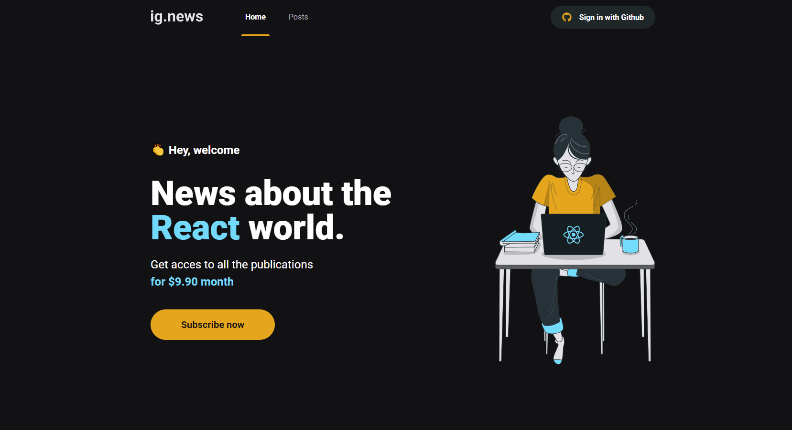
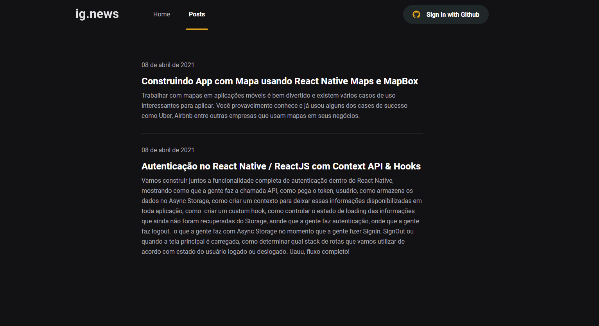
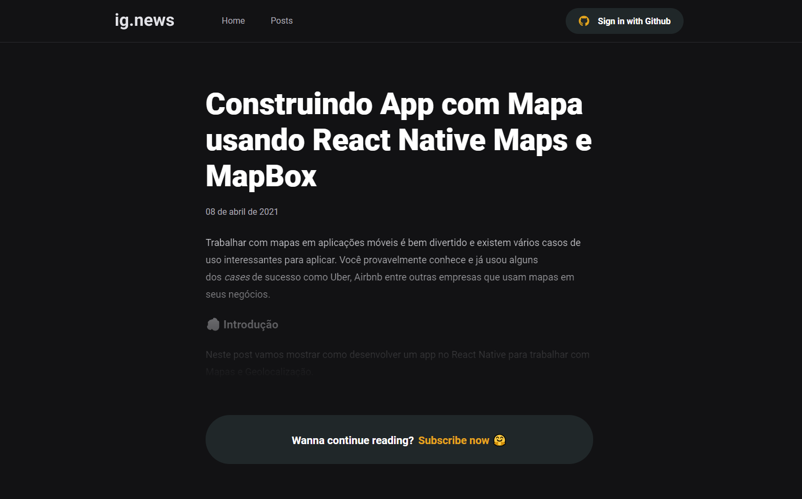
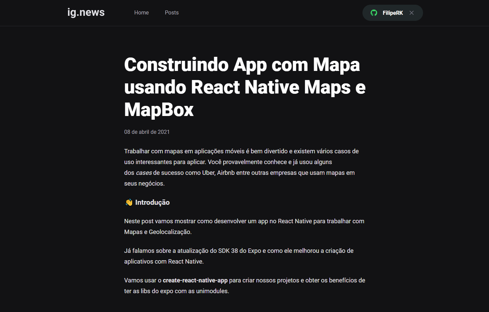

<h1 align="center">
    ig.news
</h1>

<h4 align="center">
  🚀 ig.news is a blog about ReactJs developed in the Ignite Bootcamp by RocketSeat.
</h4>

## 💻 Projeto

The project aims to study and develop an application in ReactJS with NextJS for listing posts and subscription system (subscription).

The application was developed using the NextJS framework applying concepts such as external API consumption, Root API, Server Side Rendering (SSR), Static Site Generation (SSG), STRIPE for subscription payments, NextAuth for authentication with Github, FaunaDB to store the information of the user in a database and Prismic CMS for adding and managing the content of the posts.

The project was developed as a practice for the classes of module 03 of Ignite by Rocketseat

# Getting Started 

These instructions will get you a copy of the full project up and running on your local machine for development and testing purposes.

The project must be built with npm, so download it below if you don't have any installed on your system.

* **Npm** is distributed with Node.js which means that when you download Node.js, you automatically get npm installed on your computer. [Download Node.js](https://nodejs.org/en/download/)

* **Yarn** is a package manager built by Facebook Team and seems to be faster than npm in general. [Download Yarn](https://yarnpkg.com/en/docs/install)


To run this server you will need a node version 12.0.0 (minimum) 


## 🛠 Technologies used

Below the technologies used to build the application

- [ReactJS](https://reactjs.org/)
- [NextJS](https://nextjs.org/)
- [TypeScript](https://www.typescriptlang.org/)
- [SASS](https://sass-lang.com/)
- [Next-Auth](https://next-auth.js.org/)
- [Stripe](https://stripe.com/)
- [FaunaDB](https://fauna.com/)
- [Prismic CMS](https://prismic.io/)

## Required settings

### ** Requirements **

Necessary to carry out the installations:

- [Git](https://git-scm.com/)
- [Yarn](https://classic.yarnpkg.com)
- [Stripe CLI](https://stripe.com/docs/stripe-cli)

Create account and configure external services:

- [Stripe](https://stripe.com/)
- [FaunaDB](https://fauna.com/)
- [Prismic CMS](https://prismic.io/)

## Stripe

This project uses Stripe api as Payment sistem so you'll neeed to create a [Stripe account](https://stripe.com/br) with a Product registred.

After creating your establishment, create the product "subscription" with at least name and value.

### Stripe CLI

Stripe CLI is a tools to recive stripe webhooks in 
development environment. To install follow the [documentation](https://stripe.com/docs/stripe-cli).


After you must run the following command in terminal to start to listen the webhooks:

```
$ stripe listen --forward-to localhost:3000/api/webhooks
```

Finally you must add this lines to `.env.local` file:

```js
STRIPE_API_KEY= // Api key
NEXT_PUBLIC_STRIPE_PUBLIC_KEY= // Public key
STRIPE_WEBHOOK_SECRET= // Webhook signing secret
STRIPE_SUCCESS_URL=http://localhost:3000/posts
STRIPE_CANCEL_URL=http://localhost:3000/
```

## FaunaDB

This project uses FaunaDB. This is a flexible, developer-friendly, transactional database available as a secure, cloud API with native GraphQL. Never again worry about database provisioning, maintenance, scaling, sharding, replication, or correctness.

After creating your FaunaDB account, follow the steps:

* Create a database with the name: ignews
* Create a collections called: users
* Create a collections called: subscriptions
* Create the index: `user_by_stripe_customer_id` on the `users` collection with the term: `data.stripe_customer_id`
* Create the index: `user_by_email` on the `users` collection with the term: `data.email`
* Create the index: `subscription_by_user_ref` on the `users` collection with the term: `data.userId`
* Create the index: `subscription_by_id` on the `subscriptions` collection with the term: `data.id`
* Create the index: `subscription_by_status` on the `subscriptions` collection with the term: `data.status`

Finally you must add this line to `.env.local` file:

```js
FAUNADB_KEY= // Api key
```

## Github

Create an OAuth application in your github's developer settings. After creating this application, copy its client_id, and generate a secret key and copy it too.

Add this lines to `.env.local` file:

```js
GITHUB_CLIENT_ID= // Client app key
GITHUB_CLIENT_SECRET= //Client app secret key
```

## Prismic

[Prismic](https://prismic.io) is a Content Management System, a tool for editing online content.

After creating your repository go to the "Custom Types" tab, add a new one with the following settings

* Type: Repeatable Type

* Name: publication

* Fields:

* UID
* Title as H1
* RichText allowing for multiple paragraphs and blank for links
* In the "Documents" tab it will be possible to add the posts.

You need to create a private key for your prismic repository. Go to `Settings >  API & Security > Repository ecurity` and select 'Private API'.

Finally you must add this line to `.env.local` file:

```js
PRISMIC_API_ENDPOINT= // Api endpoint
PRISMIC_ACCESS_TOKEN= // Api secret token
```

### ** Project clone **

```bash
# Run the git clone command to clone the repository
$ git clone https://github.com/FilipeRK/Ignite-ChapterIII-ig.news.git
# Enter the cloned repository folder
$ cd Ignite-ChapterIII-ig.news
```

### ** Starting the project **

```bash
# Run yarn to install the dependencies
$ yarn

# At the root of the project, create a copy of the .env.example file
# Change the name of the copy to .env.local

# Run stripe listen to listen to webhook events
$ stripe listen --forward-to localhost:3000/api/webhooks 

# To start the application
$ yarn dev

```

# Screenshots 

* Home Page



* Posts Page



* Post Preview Page



* Complete Post Page



<p >Developed by <a href="https://github.com/FilipeRK">Filipe Kohls </a>
